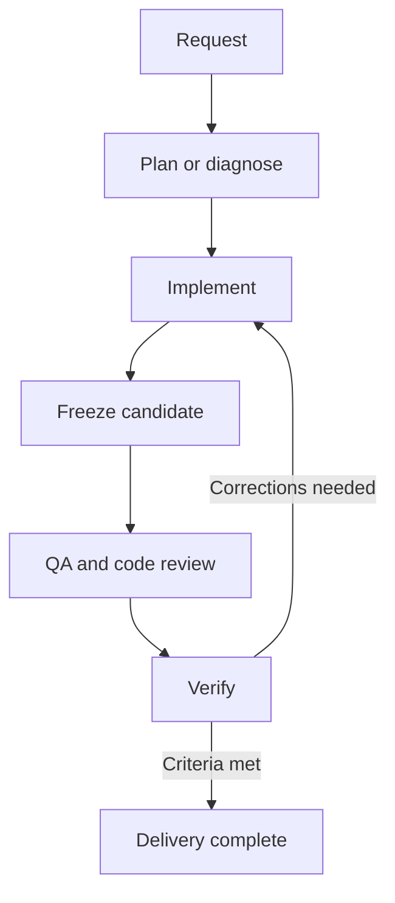

# Jerry SDLC

Jerry SDLC is a Codex plugin that coordinates planning, implementation, debugging, testing, and review. Describe the outcome you want; Jerry selects a workflow and a proportionate team of specialist roles.

**Experimental:** everyday delivery is available for evaluation. Release readiness has unmet assurance and evaluation requirements and must not be used as a production release authority. See [project status](docs/status.md) and [security boundaries](SECURITY.md).

## Get started

Use a Codex CLI version with plugin support. Linux x86-64 has experimental execution evidence; macOS binaries are included but native validation is pending. See [compatibility](docs/compatibility.md).

1. Register this repository as a marketplace:

   ```sh
   codex plugin marketplace add https://github.com/marwain91/jerry-sdlc.git
   ```

2. Open Codex, use `/plugins`, and install **Jerry SDLC** from the **Personal** marketplace. `personal` is the catalog name shipped by this repository. If your organization restricts marketplace sources, its policy applies.
3. Start a new conversation in your project and ask Jerry to do a task:

   ```text
   Use Jerry SDLC to fix this bug and verify the regression.
   ```

   To select the bundled skill explicitly:

   ```text
   $jsdlc-orchestrate review the current changes for correctness and missing tests.
   ```

The plugin bundles its CLI; Go is needed only for development. Default use requires no `jsdlc init`, generated project files, or PATH changes. Existing repository instructions and CI remain authoritative.

Marketplace registration follows the [official plugin setup guide](https://developers.openai.com/plugins/build/plugins#add-a-marketplace-from-the-cli). Installation surfaces are described in [OpenAI's plugin documentation](https://learn.chatgpt.com/docs/plugins#use-plugins-from-a-supported-surface).

## Choose a task

| Request | Workflow |
|---|---|
| “Implement this feature” | Plan → implement → test → review → verify |
| “Fix this bug” | Diagnose → implement → regression checks → review → verify |
| “Investigate why this fails” | Diagnose and report the supported cause |
| “Review this PR” | Read-only findings with locations and evidence |
| “Fix this typo” | Make the edit and verify it proportionately |
| “Investigate this outage” | Coordinate impact, diagnosis, and authorized mitigation checks |
| “Assess release readiness” | Formal QA strategy, specialist reviews, and final verification |

The Orchestrator coordinates each workflow. Planning and debugging establish what to change; the Implementer owns edits; QA and reviewers gather evidence; the Verifier checks the final result. Higher-risk changes receive additional specialist attention.



This is the typical implementation flow. Investigation and review requests keep their read-only scope. See the [workflow and role reference](plugins/jerry-sdlc/skills/jsdlc-orchestrate/references/delivery-workflows.md) for exact teams and exit conditions.

## Understand the result

Everyday workflows report `COMPLETE`, `ISSUES`, `INCOMPLETE`, or `BLOCKED` for the exact repository content reviewed. Changing that content requires fresh evidence. Delivery completion does not affect release readiness or prove production recovery.

Release readiness is a separate assessment. Local evidence cannot establish trusted worker independence, and a readiness verdict never grants permission to publish, tag, deploy, or release.

## Documentation and development

| Guide | Contents |
|---|---|
| [Architecture](docs/architecture.md) | Repository layout, workflow contracts, state, and evidence |
| [Project status](docs/status.md) | Implemented capabilities, evidence, and remaining work |
| [Compatibility](docs/compatibility.md) | Platforms, adapters, and plugin coexistence |
| [Evaluation](docs/evaluation.md) | Reproduction, original results, and quality thresholds |
| [Contributing](CONTRIBUTING.md) | Container-based development and contribution requirements |
| [Security](SECURITY.md) | Trust boundaries and vulnerability reporting |

Licensed under [Apache License 2.0](LICENSE).
